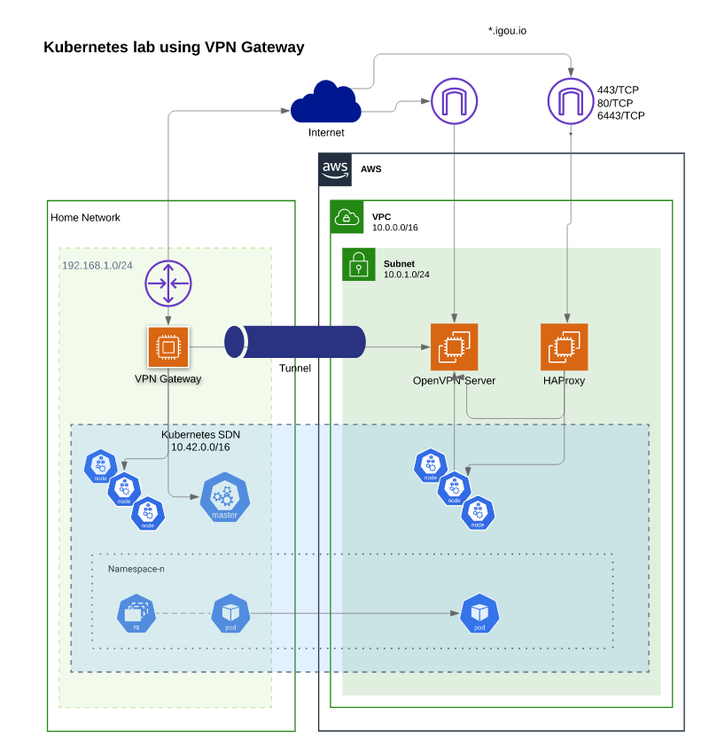

# igou-infrastructure

This repository contains Terraform and Ansible used to build my lab.

This setup is something I've dubbed the "Budget Hybrid Cloud" - simply being made of Raspberry Pis running Rancher K3's in my home, with traffic load balanced to K3OS nodes in AWS through an OpenVPN gateway.

The inspiration for this was being able to quickly serve internet facing applications, avoiding large cloud costs (This can be ran on t2.nanos for ~15 USD/month), and keeping heavy processing on the Pi 4's.

1. [Design](#design)
1. [Prerequisites](#prerequisites)
1. [Installation](#installation)
1. [Configuration](#configuration)
1. [Planned developments](#planned-developments)

## Design

Routing between an AWS VPC and a gateway node on your home network allows an easy deployment of a Kubernetes cluster sharing resources between your on-prem lab. This avoids cloud costs for dedicated processing, and easily exposing those applications to the internet.



## Prerequisites

At a bare minimum, the following hardware is required:

* A router you can add static routes to (You can technically manually add routes to each node but strongly discouraged)
* A Gateway node that will forward traffic to/from your AWS VPC (I use a Raspberry Pi 4, 1GB)
* K3s Master node (I use a Raspberry Pi 4, 4GB)

Additionally, an AWS account.

## Installation

```
cd terraform
# Export AWS Keys
terraform plan
terraform apply
cd ansible
export TF_STATE=../terraform
ansible-playbook -i inventory/ configure-tunnel.yml
ansible-playbook -i inventory/ configure-loadbalancer.yml
```
## Configuration

Refer to `docs/`

## Planned developments

I am constantly working to optimize this and create my infrastructure as reproducable as possible. Feedback is welcome.
